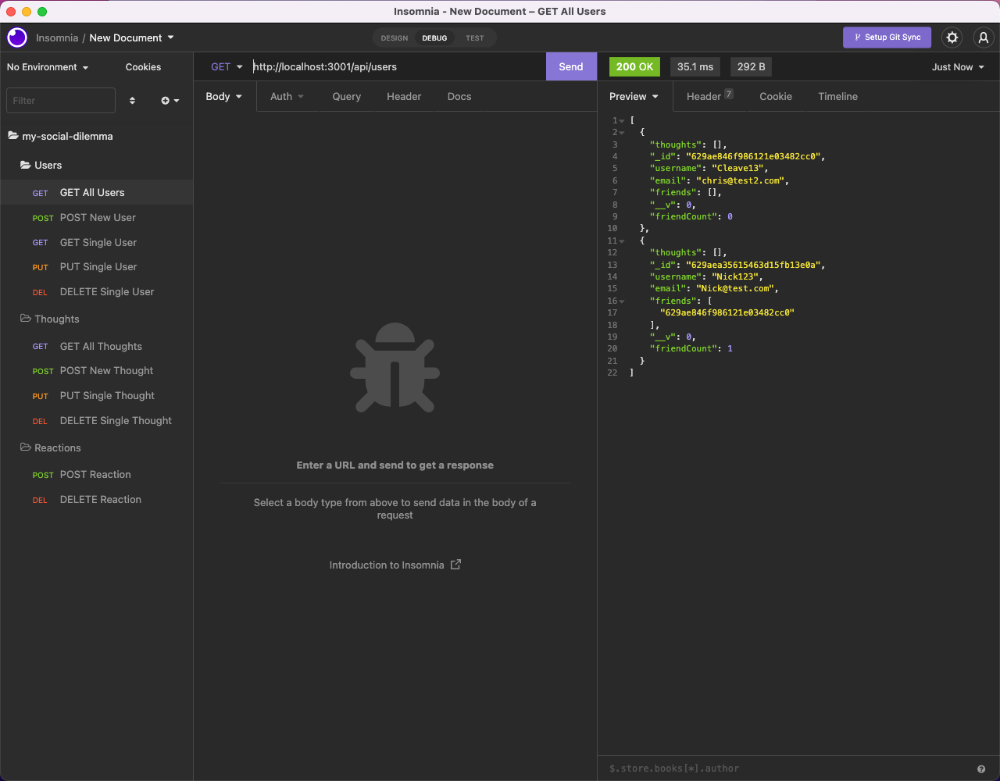

# my-social-dilemma

## Description

This application leverages a NoSQL database through MongoDB. It uses the Mongoose ODM and and express routers to allow for CRUD operations through the API. It simulates a social media backend where users can post thoughts and reactions as well as capture friends.

## Badges

 

## Table of Contents

- [Installation](#installation)
- [Usage](#usage)
- [License](#license)
- [Contributing](#contributing)
- [Tests](#tests)
- [Questions](#questions)

## Installation

After cloning the repository to your local machine, run the `npm i` command in your integrated terminal to install all of the package dependencies.

## Usage

Start the application by running the `npm start` script. Once the server is running, you can leverage an HTTP request tool like Postman or Insomnia to test all of the API endpoints. All of the responses should return in JSON format and the POST and PUT requests must also be formatted in JSON.

## License

This project is licensed under the terms of the [MIT license](https://choosealicense.com/licenses/mit/).

## Contributing

There is an internal server error with a couple of the API routes for the Thoughts model. I'd love any input into what would be causing these issues.

## Tests

There are no tests for this application.

## Questions

This application was created by [Chris Leavengood](https://github.com/Cleave13). Any questions related to this application can be sent to chrisleavengood@gmail.com